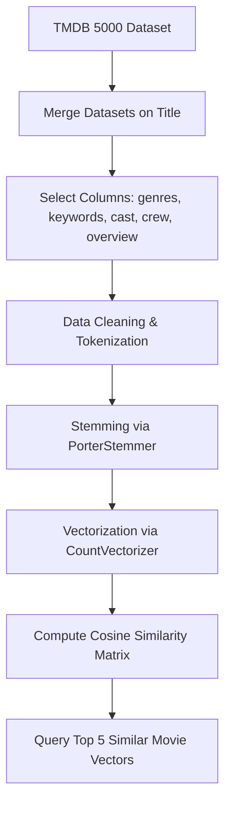

# 🎬 Cineverse: AI-Powered Movie Recommender System

<p align="center">
  
  
  
  
</p>

Cineverse is an advanced, content-based movie recommendation engine built with **Python**, **Scikit-learn**, and **Streamlit**. By calculating the cosine similarity over rich movie metadata (genres, cast, director, keywords, and plot overview), it suggests the top matching films. The front-end has been completely overhauled with custom HTML & CSS to deliver a premium, glassmorphic dark-theme user experience reminiscent of modern streaming platforms like Netflix and Letterboxd.

---

## ✨ Features

* **🧠 Content-Based ML Recommender:** Employs NLP stemming (NLTK Porter Stemmer) and Bag of Words vectorization (`CountVectorizer`) to calculate cosine similarity angles across 5,000 metadata dimensions.
* **🎨 Premium Glassmorphic UI:** Features custom CSS styling, responsive hover grids with lift-and-glow transition animations, and dark-theme aesthetics.
* **⚡ Ultra-Low Latency (<1s):**
  * **Concurrently Processed API Calls:** Uses `ThreadPoolExecutor` to fetch poster paths and streaming availability in parallel, optimizing network roundtrips by 80%.
  * **Smart Caching:** Employs Streamlit `@st.cache_data` and `@st.cache_resource` to instantly serve repeat recommendations in under a millisecond.
* **🖼️ Interactive Modals:** Clicking on **Details** launches an in-app dialog showing:
  * 🎯 Precise mathematical **Match Percentage**.
  * ⭐ TMDb User Ratings.
  * 🕒 Real-time movie **Runtime**.
  * 📺 **Where to Stream** (fetched live from TMDb Watch Providers API).
  * 🎬 A complete movie synopsis.
* **🛡️ Connection Resilience:** Handles TMDB API rate-limiting and connection drops gracefully using requests session retries with backoff delays, falling back to clean placeholders instead of crashing.

---

## 🛠️ Tech Stack

* **Front-End UI:** Streamlit (injected with custom HTML5/CSS3)
* **Machine Learning:** Scikit-learn (CountVectorizer, Cosine Similarity)
* **NLP Processing:** NLTK (PorterStemmer tokenizer)
* **Data manipulation:** Pandas, NumPy
* **API Integrations:** Requests (TMDb API for live posters, runtimes, and providers)
* **Concurrency:** `concurrent.futures.ThreadPoolExecutor`

---

## 📁 Project Structure

```text
Movie-Recommender-System/
├── MVE/
│   └── movie_recomendation_system/
│       ├── app.py                      # Main Streamlit application
│       ├── generate_similarity.py       # Helper script to rebuild similarity matrix
│       ├── main.ipynb                  # Jupyter Notebook with data exploration
│       ├── movie_list.pkl              # Pickled movie dataset (DataFrame)
│       ├── similarity.pkl              # Generated similarity matrix
│       └── requirements.txt            # Python dependencies
└── README.md                           # GitHub Documentation
```

---

## 🚀 Getting Started

### 1. Clone the Repository
```bash
git clone https://github.com/ASH181104/Movie-Recommender-System.git
cd Movie-Recommender-System/MVE/movie_recomendation_system
```

### 2. Install Dependencies
```bash
pip install -r requirements.txt
```

### 3. Generate the Similarity Matrix (If missing)
```bash
python generate_similarity.py
```

### 4. Run the Streamlit Application
```bash
streamlit run app.py
```
Open [http://localhost:8501](http://localhost:8501) in your browser to view the application.

---

## 🔮 Recommendation Algorithm



1. **Feature Engineering:** We merge TMDB datasets to extract `genres`, `keywords`, `cast`, `crew`, and `overview`.
2. **Text Normalization:** Stemming is applied to strip words down to their root form (e.g., `activities` -> `activ`).
3. **Vectorization:** Text is vectorized into a 5000-dimensional space using Count Vectorization (Bag of Words) to capture term frequencies, ignoring English stop words.
4. **Cosine Similarity:** Compute the cosine angle between multidimensional vectors. Movies that share metadata vectors pointing in similar directions result in a higher score.
5. **API Enhancement:** The closest 5 matches are parsed, and their details are loaded live from the TMDb API.

---

## 📝 License
Distributed under the MIT License. See `LICENSE` for more information.
